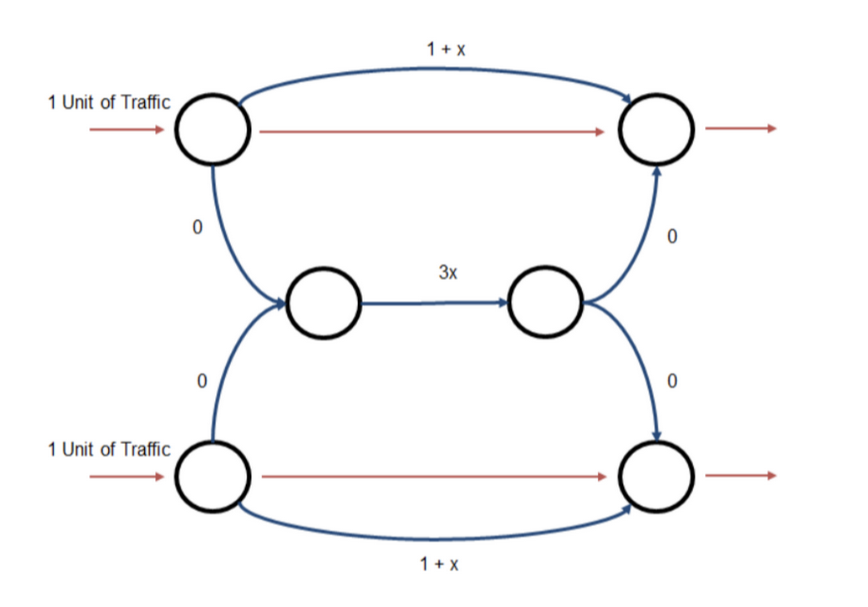

Load the required libraries:

```{r, output='none'}
library(igraph)
library(ggplot2)
library(tidyr)
library(tidyverse)
```

# Cascades and Network Structure

## Exercise 1: Impact of Community Structure on Disease Dynamics

In this question, we explore via numerical simulation the impact that community structure has on the dynamics of disease using the "planted partition" model.

### (a) Visualizing Community Strength

Generate and create simple visualizations of three graphs using the following parameters: - **Population size (**$n$): 100 - **Number of communities (**$c$): 2 - **Average degree (**$d$): 10 - **Community strength (**$\epsilon$): $\{0, 4, 8\}$

```{r}

# Basic parameters for the networks: 
n <- 100 # population size of the networks
c <- 2 # number of communities
d <- 10 # average degree
epsilons <- c(0,4,8) # community strengths

# We created a function to generate the graphs and compute the p and q
generate_planted_partition <- function(n, c, d, epsilon) {
  # Based on the mapping mentioned in the slides:
  p <- (d + epsilon) / n
  q <- (d - epsilon) / n
  
  # Define the probability matrix for the Stochastic Block Model
  # Diagonal elements are 'p' (within), off-diagonals are 'q' (across)
  pref_matrix <- matrix(q, nrow = c, ncol = c)
  diag(pref_matrix) <- p
  
  # Generate the graph using the Stochastic Block Model
  g <- sample_sbm(n, pref_matrix, block.sizes = rep(n/c, c), directed = FALSE)
  return(g)
}

# Generate and plot the three graphs
par(mfrow = c(1, 3), mar = c(1, 1, 3, 1)) # Layout for 3 plots

for (eps in epsilons) {
  set.seed(42) # For reproducibility
  g <- generate_planted_partition(n, c, d, eps)
  
  # Assign colors based on community (first 50 in group 1, next 50 in group 2)
  V(g)$color <- c(rep("skyblue", n/2), rep("orange", n/2))
  
  plot(g, 
       vertex.label = NA, 
       vertex.size = 7, 
       layout = layout_with_fr(g), 
       main = paste("Epsilon =", eps))
}

```

**Task:** Comment on the strength of the community structure each of these graphs exhibits, noting how $\epsilon$ maps into the probabilities $p$ (within-group) and $q$ (across-group).

After plotting the graphs we clearly see the differences described in class.

-   $\epsilon = 0:$ represents a standard ER random graph where $p = q$ meaning there is no distinguishable community structure. This theoretical framework can clearly be seen in the first plot where the communities cannot be distinguished from one another.

-   $\epsilon = 4:$ represents a graph where the within-group probability increases while the across-group probability decreases. Consistently, the graph visualization shows that we begin to see distinct clusters forming.

-   $\epsilon = 8:$ represents a strong community structure. On this setting nodes are much more likely to connect to others within their own group rather than to the other community. This characteristic results in a much more clearly separated visual clusters.

If we were to continue increasing $\epsilon$ until it equalized to d, then $q = 0$ and we would have two completely disconnected communities.

### (b) Independent Cascade Model Simulation

Using a simple SI spreading process where the transmission probability $p$ is constant: - **Parameters:** $n=1000$, $d=8$, and $\epsilon=0$. - **Simulation:** Measure the average epidemic size $\langle s/n \rangle$ and average epidemic length $\langle l \rangle$ as a function of $p \in [0, 1]$. - **Requirement:** Average the measured $s$ and $l$ over multiple draws to ensure smooth functions. Vary $p$ slowly enough to capture high resolution in regions where the size or length changes quickly.

```{r}
# Setup Parameters again
n <- 1000
d <- 8
epsilon <- 0 # ER random graph model

#Function to simulate one SI Epidemic
simulate_si_ic <- function(graph, p) {
  n <- igraph::vcount(graph)
  adj <- igraph::as_adj_list(graph)
  
  states <- rep(FALSE, n)
  seed <- sample(1:n, 1)
  states[seed] <- TRUE
  newly_infected <- seed
  t <- 1
  
  while (length(newly_infected) > 0) {
    next_wave <- c()
    for (u in newly_infected) {
      neighbors <- as.integer(adj[[u]])
      susceptible <- neighbors[!states[neighbors]]
      if (length(susceptible) > 0) {
        hits <- susceptible[runif(length(susceptible)) < p]
        states[hits] <- TRUE
        next_wave <- c(next_wave, hits)
      }
    }
    newly_infected <- unique(next_wave)
    if (length(newly_infected) > 0) t <- t + 1
  }
  
  c(size = sum(states) / n, length = t)
}

# Denser p grid near the critical threshold (~1/d = 0.125)
p_values <- sort(unique(c(
  seq(0,    0.05, by = 0.005),
  seq(0.05, 0.35, by = 0.008),  # dense near critical point
  seq(0.35, 1.0,  by = 0.05)
)))

results <- data.frame()

for (p_trans in p_values) {
  n_sims <- ifelse(p_trans < 0.35, 300, 80)
  # Regenerate network on every replication (both sources of randomness)
  temp_results <- replicate(n_sims, {
    g <- generate_planted_partition(n = 1000, c = 2, d = 8, epsilon = 0)
    simulate_si_ic(g, p_trans)
  })
  
  results <- rbind(results, data.frame(
    p      = p_trans,
    size   = mean(temp_results["size",   ]),
    length = mean(temp_results["length", ])
  ))
  
  cat("p =", round(p_trans, 3), "done\n")
}

# Epidemic Size Plot
ggplot(results, aes(x = p, y = size)) + 
  geom_line(color = "blue", size = 1) + 
  labs(title = "Average Epidemic Size <s/n>", x = "Transmission Probability (p)", y = "Fraction of Nodes Infected") +
  theme_minimal()

# Epidemic Length Plot
ggplot(results, aes(x = p, y = length)) + 
  geom_line(color = "red", size = 1) + 
  labs(title = "Average Epidemic Length <l>", x = "Transmission Probability (p)", y = "Time Steps") +
  theme_minimal()
```

**Discussion:**

1.  Comment on the qualitative behavior of these relationships relative to $p$.

As we saw in class, for low values of $p$, the infection dies out quickly because it only affects a tiny fraction of the whole network. As $p$ crosses a certain threshold, the magnitude of the infection jumps significantly toward 1 meaning all the network population is being infected.

The length of the epidemic typically exhibits a non-monotonic "peaked" behavior meaning that for low values of $p$ the length of the epidemic is short because the infection fails to spread and the disease gets 'eradicated' almost immediately. Yet, when we reach a certain $p$ threshold, the length of the epidemic hits its maximum, meaning that the spread is high enough for contagion to continue occurring as time goes by but it is not too high for the epidemic to be spread to all the nodes within a little period of time. Therefore, when $p$ is high that means that the spread is really fast and consequently, the length is shorter.

2.  Is there a critical value of $p$ where a phase transition occurs?

Yes, as mentioned earlier, there is a critical value of $p$ when phase transition occurs. This phenomenon can be validated by the plots in this section. For a random network ($\epsilon = 0$) as the one we are using in this section, the theoretical epidemic threshold is approximately $p \approx \frac{1}{d}$. Given that the average degree in this setting is 8, the theoretical threshold should be $p \approx 0.125$ which is approximately what we observe in the graphs computed.

### (c) Community Structure and Epidemic Size

Investigate whether the strength of community structure enhances, limits, or has no effect on epidemic size using $n=200$ and $d=8$.

The code calculates within-group probability $p = (d+\epsilon)/n$ and across-group probability $q = (d-\epsilon)/n$

Because we are working with the same average degree d, we would have the same $p$ theoretical value.

**Task:**

-   Characterize how $\epsilon \in [0, 2c]$ impacts epidemic size $s/n$ and/or length $l$ using clear figures.

```{r}

# Parameters
n <- 200
d <- 8
c <- 2
n_sims <- 100
p_values <- sort(unique(c(
  seq(0, 0.05, by = 0.005),
  seq(0.05, 0.35, by = 0.01),
  seq(0.35, 1.0, by = 0.05)
)))
epsilon_values <- c(0, 2, 4)

all_results <- data.frame()

for (eps in epsilon_values) {
  for (p_trans in p_values) {
    sims <- replicate(n_sims, {
      p_in  <- (d + eps) / n
      p_out <- (d - eps) / n
      pref_matrix <- matrix(p_out, nrow = c, ncol = c)
      diag(pref_matrix) <- p_in
      g <- sample_sbm(n, pref_matrix, block.sizes = rep(n/c, c))
      simulate_si_ic(g, p_trans)
    })
    all_results <- rbind(all_results, data.frame(
      p       = p_trans,
      epsilon = as.factor(eps),
      size    = mean(sims["size",   ]),
      length  = mean(sims["length", ])
    ))
  }
}

ggplot(all_results, aes(x = p, y = size, color = epsilon)) +
  geom_line(size = 1) +
  labs(title = "Epidemic Size vs. Community Strength",
       x = "Transmission Probability (p)", y = "s/n") +
  theme_minimal()

ggplot(all_results, aes(x = p, y = length, color = epsilon)) +
  geom_line(size = 1) +
  labs(title = "Epidemic Length vs. Community Strength",
       x = "Transmission Probability (p)", y = "Time Steps (l)") +
  theme_minimal()
```

-   Discuss the qualitative shape of these functions compared to your results in part (1b).

Theoretically, as epsilon increases the communities become more isolated from each other which introduces friction to the system. The theoretical $p$ for the entire network shifts to the right (increases) because now the infection needs higher transmission probability to successfully jump across groups.

Against theory we show that as epsilon increases, $p$ is not necessarily moved to the left and the length of the epidemic is also not peaking after. The plausible explanation found for those results is due to another force affecting the networks as we increase the within-group connections. When epsilon increases, nodes from a group are more connected between them but less connected with other groups. In our setting, the increase of node links within a community counteracts the fact that is should be more difficult for the disease to spread to the other group within the network, concluding on pretty similar graphs like the ones in part b.

-   Provide a brief intuitive explanation for why community structure strength does or does not impact the shape of the epidemic.

In our context, community strength does not impact the shape of the epidemic but maybe it would for higher epsilon. The graphs below also include higher epsilons to understand the spread pattern when the groups are even stronger. The results follow the idea that the more clustered the groups are and consequently, the more isolated are from one another, the force that shape the infection spread change and it reaches a point where only half of the population is being infected because we reach the critical partition where q goes to 0 and the groups are not connected anymore.

------------------------------------------------------------------------

# Optimal Seeding

## Exercise 2: Diffusion and Seed Optimization

This exercise simulates diffusion models to find optimal seeds using a real-world network dataset.

### (a) Technology Diffusion Simulation

For $\lambda=1$ and $\lambda=2$, conduct technology diffusion simulations where each individual draws an adoption threshold $\tau_i$ from a normal distribution $\mathbb{N}(\lambda, 0.5)$, truncated to be strictly positive.

-   **Mechanism:** A node becomes informed in the next period if she is connected to at least $\tau_i$ informed individuals.
-   **Duration:** Run the model for four periods.
-   **Metric:** Simulate the model 60 times for each potential pair of seeds to create a measure of the average information rate.

```{r}
edge_data <- read.table(gzfile("email-Eu-core.txt.gz"), header = FALSE) # load the data

# Add 1 to convert from 0-indexed to 1-indexed
edge_data <- edge_data + 1

# Convert to graph
g_full <- graph_from_edgelist(as.matrix(edge_data), directed = FALSE) #assumed undirected to simplify
g_full <- simplify(g_full) #simplify the network 

# Keep largest connected component
components <- components(g_full)
largest_id <- which.max(components$csize)
g <- induced_subgraph(g_full, which(components$membership == largest_id))

cat("Nodes:", vcount(g), "| Edges:", ecount(g), "\n")

plot(g, vertex.size = 3, vertex.label = NA, 
     main = "Email EU Core Network")
```

```{r}

# Threshold diffusion simulation 
# tau_i ~ truncated Normal(lambda, 0.5) --> strictly positive
# A node adopts when #adopted_neighbors >= tau_i
# Run for 4 periods
# seeds start as adopted at t=0

simulate_diffusion <- function(g, seeds, lambda, n_periods = 4) {
    n   <- vcount(g)
  adj <- as_adj_list(g, mode = "all")   # neighbor list (undirected)
  
  # Draw truncated Normal thresholds (strictly positive)
  repeat {
    tau <- round(rnorm(n, mean = lambda, sd = 0.5))
    if (all(tau >= 1)) break
    tau[tau < 1] <- 1   # truncate to be strictly positive
  }
  
  adopted <- rep(FALSE, n)
  adopted[seeds] <- TRUE
  
  for (t in 1:n_periods) {
    newly <- which(!adopted & 
                   sapply(1:n, function(i) sum(adopted[as.integer(adj[[i]])]) >= tau[i]))
    adopted[newly] <- TRUE
  }
  
  return(sum(adopted) / n)   # information rate
}

```

The simulation that is going to be generated thanks to the function above captures adoption through peer pressure. Truncating the normal distribution ensures the thresholds remain physically meaningful (\> 0). Running the code for 4 periods allows us to see the initial cascade effect without having to wait for everyone to adopt. The 60 replications per pair average out the threshold randomness.

### (b) Optimal Seed Identification

Identify and provide the identity of the optimal pair of seeds for both $\lambda=1$ and $\lambda=2$.

```{r}
# Precompute adjacency list ONCE outside to speed up the code. 
adj_precomp <- as_adj_list(g, mode = "all")
n           <- vcount(g)

# Fix: handle case where vertex names are NULL after subgraph extraction
node_ids <- if (is.null(V(g)$name)) as.character(1:vcount(g)) else V(g)$name

# Faster diffusion using precomputed adj
simulate_diffusion_fast <- function(seeds, lambda, n_periods = 4) {
  tau     <- pmax(1L, round(rnorm(n, mean = lambda, sd = 0.5)))
  adopted <- rep(FALSE, n)
  adopted[seeds] <- TRUE
  
  for (t in 1:n_periods) {
    counts <- sapply(1:n, function(i) sum(adopted[as.integer(adj_precomp[[i]])]))
    newly  <- which(!adopted & counts >= tau)
    if (length(newly) == 0) break
    adopted[newly] <- TRUE
  }
  sum(adopted) / n
}

run_optimal_seeding <- function(lambda) {
  cat("\nRunning lambda =", lambda, "...\n")
  
  deg <- degree(g, mode = "all")
  
  # Stage 1: quick screen with top 25 nodes, 20 reps
  top_k      <- 25
  n_mc_quick <- 20
  candidates <- order(deg, decreasing = TRUE)[1:top_k]
  pairs      <- combn(candidates, 2)
  
  rates <- apply(pairs, 2, function(seeds)
    mean(replicate(n_mc_quick, simulate_diffusion_fast(seeds, lambda)))
  )
  
  # Stage 2: refine top 10 pairs with full 60 reps
  top_pairs  <- order(rates, decreasing = TRUE)[1:10]
  rates_full <- sapply(top_pairs, function(j)
    mean(replicate(60, simulate_diffusion_fast(pairs[, j], lambda)))
  )
  
  best_j    <- top_pairs[which.max(rates_full)]
  best_pair <- pairs[, best_j]
  best_rate <- max(rates_full)
  
  # Report both internal index and original node ID
  cat("Optimal seeds (indices):", best_pair, "\n")
  cat("Optimal seeds (node IDs):", node_ids[best_pair], "\n")
  cat("Average information rate:", round(best_rate, 4), "\n")
  
  list(best_pair  = best_pair, 
       best_ids   = node_ids[best_pair], 
       best_rate  = best_rate)
}

set.seed(42)
res_lambda1 <- run_optimal_seeding(lambda = 1)
res_lambda2 <- run_optimal_seeding(lambda = 2)
```

With a threshold of 1, a node adopts as soon as any single neighbor has adopted. The diffusion process is highly permissive, so nearly 98.6% of the network becomes informed within 4 periods regardless of seed choice. Nodes 161 and 212 are the best pair under this setting.

With a threshold of 2, adoption requires at least two informed neighbours simultaneously. This is a much more demanding condition and the information rate drops to 91.3%, which will be the percentage of the network informed after the four periods. The optimal seeds shift to nodes 83 and 421. Under stricter thresholds, the best seeds are not necessarily the highest-degree nodes but rather nodes that are well-positioned to create overlapping neighbourhoods, so that they share many common neighbours.

The drop of the information rate illustrates the friction created by a higher threshold as even with the best possible pair of seed in $\lambda = 2$, almost a 9% of the network still is not adopting the technology after 4 periods.

```{r}
# Report optimal pairs
cat("\n── λ = 1 ──\n")
cat("Optimal seeds:", node_ids[res_lambda1$best_pair], "\n")
cat("Average information rate:", round(res_lambda1$best_rate, 4), "\n")

cat("\n── λ = 2 ──\n")
cat("Optimal seeds:", node_ids[res_lambda2$best_pair], "\n")
cat("Average information rate:", round(res_lambda2$best_rate, 4), "\n")
```

Evaluating all the pairs (around 500.000) is computationally really demanding, so the code pre-screens the top 50 nodes by degree and searches all (50 choose 2) = 1.225 pairs among them. \### (c) Monte Carlo Comparison

Run the same Monte Carlo simulation using randomly chosen seeds. Compare the rates of information diffusion with the optimal seeds identified in part (a) and discuss your findings.

```{r}
# Compare with random seeds
n_random_trials <- 50 
n_mc_random     <- 20   # 60 → 20 reps per random pair

compare_seeds <- function(lambda, optimal_rate) {
  random_rates <- replicate(n_random_trials, {
    seeds <- sample(1:n, 2)
    mean(replicate(n_mc_random, simulate_diffusion_fast(seeds, lambda)))
  })
  
  cat("\n── λ =", lambda, "──\n")
  cat("Optimal seed rate:     ", round(optimal_rate,        4), "\n")
  cat("Random seeds mean rate:", round(mean(random_rates),  4), "\n")
  cat("Random seeds max rate: ", round(max(random_rates),   4), "\n")
  
  data.frame(lambda = lambda, rate = random_rates)
}

rand1 <- compare_seeds(1, res_lambda1$best_rate)
rand2 <- compare_seeds(2, res_lambda2$best_rate)

# Plot
rand_all <- rbind(
  transform(rand1, lambda = "λ=1"),
  transform(rand2, lambda = "λ=2")
)
optimal_lines <- data.frame(
  lambda   = c("λ=1", "λ=2"),
  opt_rate = c(res_lambda1$best_rate, res_lambda2$best_rate)
)

ggplot(rand_all, aes(x = rate)) +
  geom_histogram(bins = 20, fill = "steelblue", color = "white", alpha = 0.8) +
  geom_vline(data = optimal_lines, aes(xintercept = opt_rate),
             color = "red", linewidth = 1.2, linetype = "dashed") +
  facet_wrap(~lambda, scales = "free") +
  labs(title    = "Random vs Optimal Seeds: Information Rate",
       subtitle = "Red dashed line = optimal pair rate",
       x = "Information Rate (fraction adopted)", y = "Count") +
  theme_minimal()
```

**Left panel**

The distribution of the random seed rates is concentrated between roughly 0.982 and 0.985, meaning that almost any pair of randomly chosen seeds achieves near-full diffusion. The optimal pair (showed by the red dashed line) is at the right tail but very little above the random average.

Intuitively, when the adoption threshold is 1, a node adopts as soon as any single neighbor has adopted, therefore, the diffusion process is so permissive that seed choice barely matters. The epidemic spreads to almost everyone regardless of where it starts.

**Right panel** There is a dramatic change between the plots. Random seeds now produce a much wider distribution between 0.5 and 0.9 with high variance. Now the optimal pair (also represented by the red dashed line) is at the far right of the distribution, substantially outperforming the average random pair.

Now that the threshold is 2, nodes need at least two neighbors to adopt before switching so the process of diffusion is much more sensitive to the local neighborhood structure of the seeds. Now, high degree seeds places in well-connected parts of the network can immediately expose many nodes to two or more adopters simultaneously, while a randomly chosen pair may sit in a sparse region and fail to reach other nodes beyond the immediate neighbor.

The main conclusion from the exercise is that optimal seeding matters most when thresholds are high. We have proved that under $\lambda = 1$ the network is easily activated while with $\lambda = 2$ the gain from choosing the right seed is substantial. Overall, as adoption becomes harder (higher $\lambda$), the identity of the initial seed becomes much more important for the final diffusion outcome.

# Routing 

## Exercise 3: Routing on Roads

Consider the traffic flow game pictured in the figure below. There are two origin-destination pairs. A unit of traffic needs to flow from the upper left to the upper right, and another unit needs to flow from the lower left to the lower right. The cost functions are given in the figure.



### (a) Socially Optimal Routing & Cost

What is the socially optimal routing, and what is its total cost?

**Solution**:

Total social cost = sum of (flow × cost) across all edges: 

$C = x_1(1 + x_1) + x_2(1+x_2) + (2 - x_1 - x_2) \cdot 3(2 - x_1 -x_2)$

Taking partials and setting equal to zero:

$\frac{\partial C} {\partial x_1} = 1 + 2x_1 − 6(2 − x_1 − x_2) = 0$

$\frac{\partial C} {\partial x_2} = 1 + 2x_2 - 6(2 - x_1 - x_2)= 0$

This implies that $x_1 = x_2 = x$. Substituting in:

$$
\begin{aligned}
1 + 2x - 6(2 - 2x) &= 0 \\
14x &= 11 \\
x &= \frac{11}{14}
\end{aligned}
$$

So $\frac{11}{14}$ on each direct path, $\frac{3}{14}$ per origin-destination through the middle.

Total cost = $14(\frac{11}{14})^2 − 22(\frac{11}{14}) + 12 = \frac{47}{14} \approx 3.357$

### (b) Equilibrium Routing & Welfare Loss

What is the equilibrium routing? What is the welfare loss relative to the optimum?

**Solution:**

At Wardrop equilibrium, all both paths for each origin-destination pair must have equal user cost; otherwise, drivers would switch.

For origin-destination 1 (top left to top right), the two path costs are:

  * Direct: $1 + x_1$
  * Middle: $3(2-x_1 - x_2)$
  
By symmetry, $x_1 = x_2 = x$. Setting both paths equal yields us:

$$
\begin{aligned}
1 + x &= 3(2-2x) \\
1 + x &= 6-6x \\
1 + 7x &= 6 \\
7x &= 5 \\
x &= \frac{5}{7}
\end{aligned}
$$

Thus, each origin-destination pair sends 5/7 direct and 2/7 through the middle.

$$
\begin{aligned}
\text{Equilibrium cost} &= 2 \left(\frac{5}{7}\right) \left(1 + \frac{5}{7}\right) + \left(\frac{4}{7}\right) 3 \left(\frac{4}{7}\right) \\
&= 2 \left(\frac{5}{7}\right) \left(\frac{12}{7}\right) + \left(\frac{4}{7}\right) \left(\frac{12}{7}\right) \\
&= \frac{120}{49} + \frac{48}{49} = \frac{24}{7} \approx 3.429
\end{aligned}
$$

$$
\text{Welfare loss} = \frac{24}{7} - \frac{47}{14} = \frac{48}{14} - \frac{47}{14} = \frac{1}{14} \approx 0.071
$$


### (c) Tolls and Subsidies

Suppose you can impose constant tolls on some edges and constant subsidies on others. Design a system of tolls and subsidies to implement the social optimum as an equilibrium.

**Solution:**

A Pigouvian toll charges each driver for the externality they impose, based on the extra delay they cause to everyone else on that edge. This is implemented to mitigate the face that the drivers overusing the middle link since they do not pay for the congestion they cause.

$$
\text{Toll on edge } e = f_e \cdot c'_e(f_e) \text{, evaluated at the social optimum flows.}
$$

$$
\begin{aligned}
&\textbf{At the social optimum:} \\
&\text{Direct edges } (c = 1 + f,\ c' = 1): \quad \tau = \tfrac{11}{14} \times 1 = \tfrac{11}{14} \\
&\text{Middle edge } (c = 3f,\ c' = 3): \quad \tau = \tfrac{3}{7} \times 3 = \tfrac{9}{7} \\
&\text{Zero-cost edges}: \quad \tau = 0 \\[6pt]
&\textbf{Verification:} \\
&\text{Direct path}: \quad \left(1 + \tfrac{11}{14}\right) + \tfrac{11}{14} = \tfrac{25}{14} + \tfrac{11}{14} = \tfrac{36}{14} \\
&\text{Middle path}: \quad 0 + 3 \cdot \tfrac{3}{7} + \tfrac{9}{7} + 0 = \tfrac{9}{7} + \tfrac{9}{7} = \tfrac{18}{7} = \tfrac{36}{14} \\
&\tfrac{36}{14} = \tfrac{36}{14} \quad \Rightarrow \quad \text{Paths are equal, so the social optimum is an equilibrium.}
\end{aligned}
$$

# Bonus: Equilibrium Flows

## Exercise 4: Replicate Youn et al 2008

### (a) Import the data

```{r}
parse_tntp_net <- function(filepath) {
  lines <- readLines(filepath)
  
  # Find the data header line (contains "init_node")
  header_idx <- grep("init_node", lines)[1]
  
  # Clean the header line (remove leading ~ and whitespace)
  header     <- trimws(gsub("~|;|\\.", "", lines[header_idx]))
  col_names  <- trimws(strsplit(header, "\t")[[1]])
  col_names  <- col_names[col_names != ""]
  
  # Read data lines (everything after the header, skip blanks)
  data_lines <- lines[(header_idx + 1):length(lines)]
  data_lines <- data_lines[trimws(data_lines) != ""]
  
  # Remove trailing semicolons and read
  data_lines <- gsub(";", "", data_lines)
  df <- read.table(text = paste(data_lines, collapse = "\n"),
                   header = FALSE, fill = TRUE)
  
  # Assign column names (drop extra cols if any)
  df <- df[, 1:length(col_names)]
  names(df) <- col_names
  
  df <- df[!is.na(df$init_node) & !is.na(df$term_node), ]
  df <- df[df$init_node > 0 & df$term_node > 0, ]
  return(df)
}


# Now we can load the files

net_data <- parse_tntp_net("Terrassa-Asym_net.tntp")
cat("Links loaded:", nrow(net_data), "\n")
cat("Columns:", names(net_data), "\n")
```

Once we have the data loaded, we proceed with the visualization of the igraph objects:

```{r}
net_data$v_ij <- 60   # fixed speed as per assignment

g_road <- graph_from_data_frame(
  d = data.frame(
    from          = net_data$init_node,
    to            = net_data$term_node,
    capacity      = net_data$capacity,
    length        = net_data$length,
    free_flow_time = net_data$length / net_data$v_ij,  # d/v in hours
    b             = net_data$b,
    power         = net_data$power
  ),
  directed = TRUE
)

cat("Nodes:", vcount(g_road), "| Edges:", ecount(g_road), "\n")
```

And finally plot Terrassa network:

```{r}
plot(g_road,
     layout          = layout_with_fr(g_road),
     vertex.size     = 2,
     vertex.label    = NA,
     edge.arrow.size = 0.1,
     edge.color      = "grey60",
     vertex.color    = "steelblue",
     main            = "Terrassa Road Network")
```

### (b) Nash Equilibrium Flow

```{r}
# Parse OD trips file
parse_tntp_trips <- function(filepath) {
  lines     <- readLines(filepath)
  nz_line   <- grep("NUMBER OF ZONES", lines, ignore.case = TRUE)[1]
  n_zones   <- as.integer(gsub("[^0-9]", "", lines[nz_line]))
  cat("OD zones:", n_zones, "\n")
  
  od_list         <- list()
  current_origin  <- NULL
  
  for (line in lines) {
    line <- trimws(line)
    if (grepl("^Origin", line, ignore.case = TRUE)) {
      current_origin <- as.integer(gsub("[^0-9]", "", line))
    } else if (!is.null(current_origin) && nchar(line) > 0 && 
               !grepl("^<", line)) {
      entries <- unlist(strsplit(line, ";"))
      for (entry in entries) {
        entry <- trimws(entry)
        if (nchar(entry) == 0) next
        parts <- strsplit(entry, ":")[[1]]
        if (length(parts) == 2) {
          dest   <- as.integer(trimws(parts[1]))
          demand <- as.numeric(trimws(parts[2]))
          if (!is.na(dest) && !is.na(demand) && demand > 0)
            od_list[[length(od_list) + 1]] <- c(current_origin, dest, demand)
        }
      }
    }
  }
  do.call(rbind, od_list) |> as.data.frame() |> 
    setNames(c("origin", "dest", "demand"))
}

od_data <- parse_tntp_trips("Terrassa-Asym_trips.tntp")
cat("OD pairs with demand:", nrow(od_data), "\n")
cat("Total demand:", sum(od_data$demand), "\n")

# Setup the edge attributes
alpha <- 0.2
beta  <- 10
v_ij  <- 60   # fixed speed kph as per assignment

# Extract edge-level data into vectors for fast computation
E_from     <- as.integer(tail_of(g_road, E(g_road)))
E_to       <- as.integer(head_of(g_road, E(g_road)))
d_ij       <- E(g_road)$length      # km
p_ij       <- E(g_road)$capacity    # vehicles
n_edges    <- ecount(g_road)
n_nodes    <- vcount(g_road)

# Latency function: l_ij(x) = (d/v) * [1 + alpha*(x/p)^beta]
latency <- function(x) {
  (d_ij / v_ij) * (1 + alpha * (x / p_ij)^beta)
}

# Potential (Beckmann) function: integral of latency
# integral_0^x l(t)dt = (d/v)*[x + alpha/(beta+1) * x^(beta+1)/p^beta]
potential <- function(x) {
  sum((d_ij / v_ij) * (x + (alpha / (beta + 1)) * x^(beta + 1) / p_ij^beta))
}

# All-or-nothing assignment
# Given current costs on edges, load ALL demand onto shortest paths
all_or_nothing <- function(costs) {
  E(g_road)$weight <- costs
  x_aon <- rep(0, n_edges)
  
  # Build edge index lookup: (from,to) -> edge index
  edge_idx <- matrix(0, nrow = n_nodes, ncol = n_nodes)
  for (e in 1:n_edges) edge_idx[E_from[e], E_to[e]] <- e
  
  # For each OD pair, find shortest path and add demand
  origins <- unique(od_data$origin)
  for (org in origins) {
    # All destinations for this origin
    dests   <- od_data$dest[od_data$origin == org]
    demands <- od_data$demand[od_data$origin == org]
    
    # Single-source shortest paths
    sp <- shortest_paths(g_road, from = org, to = dests,
                         weights = E(g_road)$weight, output = "epath")
    
    for (k in seq_along(dests)) {
      epath <- as.integer(sp$epath[[k]])
      if (length(epath) > 0)
        x_aon[epath] <- x_aon[epath] + demands[k]
    }
  }
  x_aon
}

# Frank-Wolfe Algorithm
cat("\nStarting Frank-Wolfe...\n")

# Initialise: load all demand onto free-flow shortest paths
x <- all_or_nothing(d_ij / v_ij)   # free-flow costs

max_iter  <- 30
tol       <- 1e-4
pot_prev  <- Inf

for (iter in 1:max_iter) {
  
  # Step 1: compute current latencies
  l_current <- latency(x)
  
  # Step 2: all-or-nothing on current costs → descent direction y
  y <- all_or_nothing(l_current)
  
  # Step 3: line search — find lambda in [0,1] minimising potential(x + lambda*(y-x))
  obj_fn <- function(lam) potential(x + lam * (y - x))
  lam    <- optimise(obj_fn, interval = c(0, 1))$minimum
  
  # Step 4: update flows
  x_new <- x + lam * (y - x)
  
  # Convergence check (relative gap)
  pot_new  <- potential(x_new)
  rel_gap  <- abs(pot_prev - pot_new) / abs(pot_prev)
  cat(sprintf("Iter %2d | lambda=%.4f | potential=%.4f | rel_gap=%.6f\n",
              iter, lam, pot_new, rel_gap))
  
  x <- x_new
  if (rel_gap < tol && iter > 3) {
    cat("Converged at iteration", iter, "\n")
    break
  }
  pot_prev <- pot_new
}

# Store and show results
E(g_road)$nash_flow    <- x
E(g_road)$nash_latency <- latency(x)
E(g_road)$nash_cost    <- x * latency(x)   # flow * travel time

total_nash_cost <- sum(E(g_road)$nash_cost)
cat("\nTotal Nash flow cost:", round(total_nash_cost, 4), "\n")

# Visualize the flow
# Colour edges by flow volume
flow_norm <- (x - min(x)) / (max(x) - min(x))
edge_cols <- colorRampPalette(c("lightblue", "orange", "red"))(100)

plot(g_road,
     layout          = layout_with_fr(g_road),
     vertex.size     = 2,
     vertex.label    = NA,
     edge.arrow.size = 0.1,
     edge.color      = edge_cols[ceiling(flow_norm * 99) + 1],
     vertex.color    = "grey30",
     main            = "Terrassa: Nash Equilibrium Flow\n(blue=low, red=high)")
```

The code below applies the algorithm that works in four steps. First it computes the current latencies from flows, then assigns all demands to the shortest paths under those latencies (which is the all or nothing step), it follows by doing a line search to find the optimal step size lambda and finally it move flows in that direction.

The output **total_nash_cost** is going to be used in part c to compare against networks with individual streets closed.

### (c) Nash Flow Cost Comparisions


### (d) Closing a Street to Decrease NE Cost


# Consensus and Influence

## Exercise 5: Opinion Dynamics

Download the Facebook100 data, containing facebook networks for 100 universities in the US. We want to analyze how the different networks generate different opinion dynamics. Keep the largest component of each network only.

```{r fb-data, output='none'}
rm(list=ls())
library(R.matlab)   # read .mat files
library(tidygraph)      # optimize data pipeline

# iterate thru files in facebook100
folder_path <- file.path("C:/Users/T14/7Programming/R/class/networks/problem_sets/ps03/data/facebook100")
file_list <- list.files(path = folder_path, 
                        pattern = "\\.mat$", 
                        full.names = TRUE)

facebook_graphs <- list() #init empty matrix

for (file in file_list){
  clean_name <- tools::file_path_sans_ext(basename(file)) # extract school name
  raw_mat <- readMat(file)                                # load in sparse matrix object
  adj_matrix <- raw_mat$A                                 # extract adj matrix stored as "A"
  tbl_g <- graph_from_adjacency_matrix(                   # convert to igraph object
    adj_matrix, 
    mode = "undirected",
    diag = FALSE # remove self-loops
  ) %>% 
    as_tbl_graph()                                        # store as a tidy graph object -- memory efficient
  facebook_graphs[[clean_name]] <- tbl_g                  # object store in list, end of iteration
}

rm(raw_mat, adj_matrix, tbl_g)                            # rm temporary objects -- free up memory
facebook_graphs$schools <- NULL                           # remove school names vector
```

### (a) Assumption: 'Listening'

To simplify things we will assume that each node "listens" to all her neighbors (and herself) with the same probability. In other words, we assume that $T_{ij} = \frac{1}{(1 + d_i)}$ for all $j \in N_i$ and also $T_{ii} = \frac{1}{(1 + d_i)}$. The assumption that the node listens to herself with the same weight makes the walk "lazy," which guarantees aperiodicity (which will be needed for convergence to consensus later on).

### (b) Assign Probabilities

We will simulate innate/original opinions from a uniform(0,1); i.e., we will assign to each node a $p_i(0)$ that is drawn from a uniform random variable. This means that the consensus should land near 0.5 for every network by the LLN (since these networks have thousands of nodes), and any deviation from that is informative about how concentrated the influence is in the network. If a few high-degree nodes happen to have extreme opinions, and those nodes dominate the stationary distribution, we should see the consensus pulled away from the expected value of 0.5.

### (c) Maximum & Median Influence

We know from the **Convergence to Consensus proposition** (Golub & Jackson) that, if T is irreducible, the following are equivalent:

  1. T is convergent
  2. T is aperiodic
  3. T has a unique (positive) left-eigenvector $s$ corresponding to eigenvalue 1 with $\sum s_i = 1$ such that for every $p \in [0, 1]^n$:
  
$$
\left(lim_{t \rightarrow \infty} T^t p \right)_i = sp  
$$
  
  for every individual $i \in N$. 
  
Furthermore, we know that **consensus** is defined as: limiting beliefs are all equal to a weighted average of initial beliefs, with agent $i$'s weight (or influence) given by $s_i$.

The influence vector $s_i$ given by the left eigenvector of $T$:

  - Note that $\lim_{t \rightarrow \infty} T^t p = \lim_{t \rightarrow \infty} T^t (Tp)$
  - It must be that $sp = sTp$ for every $p \in [0,1]^n$
  - This implies that $s = sT$
  
The eigenvector property says that, for all $i$: 

$$
s_i = \sum_{j \in N} T_{ji}s_j
$$

  - The influence of $i$ is the weighted sum of the influences of individuals $j$ that pay attention to $i$
      - Influence of $j$ is weighted by $T_{ji}$ which is the trust $j$ places on $i$

Thus, to impute the influence of a network we must compute the left eigenvector of $T$. So do so, we must find the vector $s$ such that $sT = s \iff T's = s$.

```{r test influence}
test <- facebook_graphs$American75
```

To find the left-eigenvalue, we must build a function that converges to $s$ after iterating through multiplications of $T'$. We start by giving everyone equal influence, after which we multiply this starting vector by a weighted combination of the values of nodes that listen to it. We then normalize to ensure the values sum to 1. We iterate through this process until we reach some threshold, such that any change in our multiplication step does not significantly update the influence vector values. First, we must build a 'listening' matrix to get an idea of how much each node listens to others.

```{r listening matrix}
library(Matrix) # fast method: using as_edgelist

listening_matrix <- function(graph_obj){ # input: graph (network) object
  n = vcount(graph_obj)
  degree = degree(graph_obj)
  weight = 1 / (1 + degree) # via assumption from part (a)
  
  edgelist <- as_edgelist(graph_obj)                             # two-column matrix of edges
  rows <- c(1:n, edgelist[,1], edgelist[,2])                     # diagonal + both directions
  cols <- c(1:n, edgelist[,2], edgelist[,1])                   
  vals <- c(weight, weight[edgelist[,1]], weight[edgelist[,2]])  # self-loops; i listen to j; j listen to i
  
  sparseMatrix(i = rows, # return of a sparse matrix of final listening matx
               j = cols, 
               x = vals, 
               dims = c(n, n))
}
```

```{r listening mat sanity check}
# sanity check
test_listening_mat <- listening_matrix(test)
test_listening_mat[1:10, 1:10] # looks good
```

Now that our listening matrix function works well, we will build the left-eigenvalue function, which takes this listening matrix as an input, as well as optional arguments regarding the tolerance (how much the influence vector changes for the function to return) as well as the max number of iterations through the function (set as 10_000)

```{r left-eigenvalue function}
left_eigenvector <- function(listening_mx,                 # inputs: - listening matrix       
                            tol = 0.00001,                #         - threshold to determine convergence
                            max_it = 10000){              #         - max num iterations thru loop
  n <- nrow(listening_mx)   # num of rows in tmat (corresponds to )
  s <- rep(1/n, n)          # set starting influence vector as equal across all nodes
  T_trans <- t(listening_mx) # transpose listening mat to perform T's
  for (i in seq_len(max_it)) { # iterative process: keep updating s until we 'converge'
    s_new <- T_trans %*% s               # matrix multpl
    s_new <- s_new / sum(s_new)          # normalize
    if (max(abs(s_new - s)) < tol) break # stop condition only if we hit below arbitrary threshold value
    s <- s_new                           # update s vector as newly multiplied vect
  }
  return(as.vector(s_new))
}
```

```{r lft-eign func sanity check}
# sanity check
test_lft_eigen <- left_eigenvector(listening_mx = test_listening_mat)
length(test_lft_eigen) == vcount(test) # should match num nodes from original network: yes
```

```{r full influence loop}
# loop over all networks, collect all influence scores
all_influences <- c()
for (name in names(facebook_graphs)) {
  g <- facebook_graphs[[name]]    # extract graph object from specified matrix
  T_mat <- listening_matrix(g)    # get associated lsitening mat
  s <- left_eigenvector(T_mat)    # get associated left-eigenvector
  all_influences <- c(all_influences, s) # append to list
}
```


```{r}
# histogram
hist(all_influences, breaks = 500, col = "goldenrod",
     main = "Influence Distribution Across Facebook100 Networks",
     xlab = "Influence score", ylab = "Frequency", xlim = c(0, 0.0012))

# summary stats
cat("max influence:   ", max(all_influences), "\n")
cat("median influence:", median(all_influences), "\n")
```

After plotting, we notice that the influence is highly skewed across nodes, with our histogram displaying a strong right-skew, with majority of the observations lying near very low influence (left of the median of 0.000044) and a max value ranging to 0.008. This suggests a power-law like structure, which we can check by plotting the complementary CDF:

```{r, error=TRUE}
df <- data.frame(influence = sort(all_influences, 
                                  decreasing = TRUE)) # arrange influence in desc order
df$rank <- 1:nrow(df)                                 # rank given as row number
df$ccdf <- df$rank / nrow(df)                         # calc complementary cdf val as: (rank)/(total # of obs)

ggplot(df, aes(x = influence, y = ccdf)) +
  geom_point(size = 0.3, color = "salmon") +
  scale_x_log10() +
  scale_y_log10() +   # log-log scale
  labs(x = "Influence (log)", y = "PDF (log)") +
  theme_bw()
```

The plot suggests that perhaps the distribution follows a log-normal structure, or some other family of exponential functions.

### (d) Histogram of Consensus Opinions

To plot a histogram of the consensus opinions, we need to generate the consensus opinions given by the relationship $\sum_{j \in P} s_jp_j(0)$

```{r consensus vector}
# consensus vector
consensus <- c()
for (name in names(facebook_graphs)) {
  g     <- facebook_graphs[[name]]       # extract graph network
  T_mat <- listening_matrix(g)           # generate listening matrix
  s     <- left_eigenvector(T_mat)       # find left eigenvector
  p0    <- runif(vcount(g))              # random initial opinions (random uniform based on n nodes)
  consensus <- c(consensus, sum(s * p0)) # s · p0: store in consensus vector
}

# sanity check
length(consensus) # 100; checks out
```


```{r consensus plotting}
# histogram
ggplot(data.frame(consensus = consensus), aes(x = consensus)) +
  geom_histogram(bins = 25, fill = "forestgreen", color = "white") +
  labs(x = "Consensus opinion p(inf)", y = "Number of networks",
       title = "Consensus Opinions Across Facebook100 Networks") +
  theme_bw() +
  theme(plot.title = element_text(hjust=0.5))

# modal bin
h <- hist(consensus, breaks = 25, plot = FALSE) # calculate hist values without plotting
modal_mid <- h$mids[which.max(h$counts)]        # extra max counts from each bin
cat("modal consensus opinion:", round(modal_mid, 3), "\n")
cat("mean consensus opinion: ", round(mean(consensus), 4), "\n")

```

The histogram shows that consensus opinions are tightly concentrated around 0.5 across all 100 networks, with a modal value of 0.501 and a mean of 0.5006. This is to be expected, as initial opinions are drawn iid from unif(0,1) dist with mean 0.5, and the influence weights sum to 1, the consensus $\sum_j s_j p_j(0)$ is a weighted average of many independent draws, which concentrates around 0.5 by LLN.

### (e) Speed of Learning Calculation

Now we want to calculate the speed of learning. For each network, calculate the first period,

$t^*$, where $\left(\sum_i \tilde{d}_i(A)(p_i(t) - p_i(\infty))^2 \right)^{\frac{1}{2}} < \varepsilon$ for $\epsilon = 0.1$ and $\tilde{d}_i(A) = \frac{d_i(A)}{\sum_i d_i(A)}$.

To do so, we simply calculate the time it takes to converge for a network:

```{r}
convergence_time <- function(T_mat, p0, s, g, epsilon = 0.1) {
  consensus <- sum(s * p0)                # p_i(\infty)
  deg       <- degree(g)                  # d_i
  d_tilde   <- deg / sum(deg)             # \tilde{d}_i = d_i / \sum_i d_i
  p         <- p0                         # start at initial opinions
  
  for (t in 1:10000) {
    p     <- as.vector(T_mat %*% p)       # one round: everyone updates
    diff  <- p - consensus                # how far each node is from consensus
    error <- sqrt(sum(d_tilde * diff^2))  # weighted error
    if (error < epsilon) return(t)        # done? exit condition
  }
  return(NA)
}
```

After which, we apply to all 100 networks.

```{r}
t_stars <- c() # init empty results list
for (name in names(facebook_graphs)) {
  g     <- facebook_graphs[[name]]
  T_mat <- listening_matrix(g)
  s     <- left_eigenvector(T_mat)
  p0    <- runif(vcount(g))
  t_star <- convergence_time(T_mat, p0, s, g) # t-star: how many iterations it takes to converge
  t_stars <- c(t_stars, t_star)               # append to our results list
}

# results
results <- data.frame(network = names(facebook_graphs), t_star = t_stars)
results <- results[order(results$t_star), ]
head(results)

cat("Fastest convergence:", min(t_stars), "\n")
cat("Slowest convergence:", max(t_stars), "\n")
cat("Median convergence: ", median(t_stars, na.rm = TRUE), "\n")
```

We see from the results that given an initial value $\epsilon = 0.1$, all of our networks converge within one iteration, meaning that a single round of local averaging is sufficient to bring opinions within 0.1 of consensus across all 100 networks. This is because the networks are sufficiently large, so the degree-weighted averaging in one step already smooths out most of the disagreement from the random initial opinions.

### (f) Second Eigenvalue Plot

We want to understand the relationship between network structure and the speed of learning. The second largest eigenvalue $\lambda_2$ of the listening matrix $T$ governs the rate at which opinions converge; specifically, disagreement decays at rate $\lambda_2^t$, so networks with $\lambda_2$ closer to 1 converge more slowly.

For each network, we compute the two largest eigenvalues of $T$. The first eigenvalue is always 1, guaranteed by the row-stochastic property of $T$ (each row sums to 1, making $\mathbf{1}$ a right eigenvector with eigenvalue 1). The Perron-Frobenius theorem additionally guarantees that this is the dominant eigenvalue for irreducible non-negative matrices. We then take the modulus of the second eigenvalue $\lambda_2$.


```{r}
library(RSpectra) # library for computing eigenvalues of large sparse matrices

# compute the second largest eigenvalue (lambda2) for each network
lambda2s <- c()                                    # init empty vector to store lambda2 vals
for (name in names(facebook_graphs)) {             # loop over each uni
  g     <- facebook_graphs[[name]]                 # extract graph object
  T_mat <- listening_matrix(g)                     # build the listening matrix
  eigs  <- eigs(T_mat, k = 2, which = "LM")        # compute top 2 eigenvalues by largest magnitude
  lambda2s <- c(lambda2s, Mod(eigs$values[2]))     # modulus of 2nd eigenvalue (handles complex values)
}
```

We compute the convergence time $t^*$ for each network at three progressively stricter thresholds: $\varepsilon = 0.1, 0.01, 0.001$. For each network and threshold, we generate random initial opinions from a unif$(0,1)$ distribution, after which we run the opinion dynamics $p(t) = Tp(t-1)$ iteratively, and record the first period $t$ at which the degree-weighted error falls below $\varepsilon$.

```{r}
# compute t* for multiple epsilon thresholds to see how strictness affects convergence
epsilons <- c(0.1, 0.01, 0.001)                    # three thresholds for eps
all_results <- data.frame()                        # init df to store results

for (eps in epsilons) {                                        # loop over each epsilon value
  t_stars <- c()                                               # init empty vector for this epsilon's t* values
  for (name in names(facebook_graphs)) {                       # loop over each school
    g     <- facebook_graphs[[name]]                           # extract graph object
    T_mat <- listening_matrix(g)                               # build listening matrix
    s     <- left_eigenvector(T_mat)                           # compute influence vector
    p0    <- runif(vcount(g))                                  # generate random initial opinions
    t_star <- convergence_time(T_mat, p0, s, g, epsilon = eps) # compute convergence time
    t_stars <- c(t_stars, t_star)                              # append t* for this network
  }
  all_results <- rbind(all_results, data.frame(    # bind results for this epsilon to the full df
    lambda2 = lambda2s,                            # second eigenvalue
    t_star  = t_stars,                             # convergence time
    epsilon = paste0("epsilon = ", eps)                
  ))
}
```


```{r}
# plot: lambda2 vs t* by each epsilon
ggplot(all_results, aes(x = lambda2, y = t_star)) +
  geom_point() +
  geom_smooth(method = "lm", se = FALSE, linetype = "dashed") +
  facet_wrap(~epsilon, scales = "free_y") + # separate panel per epsilon, y-axis scales independently
  labs(x = expression(lambda[2]),
       y = expression(t^"*"),
       title = expression(paste("Convergence Time vs ", lambda[2]))) +
  theme_bw()

```

At $\varepsilon = 0.1$, all networks converge within a single iteration, meaning that the threshold is too lenient given the size and density of the Facebook100 networks. As we lower $\varepsilon$, convergence times increase and a clear positive relationship with $\lambda_2$ emerges. This suggests that networks whose second eigenvalue is closer to 1 take more rounds to reach consensus, confirming that $\lambda_2$ governs the speed of learning. A value of $\lambda_2$ near 1 indicates high modularity, meaning that loosely connected communities create a bottleneck that slows the diffusion of opinions across the network.


